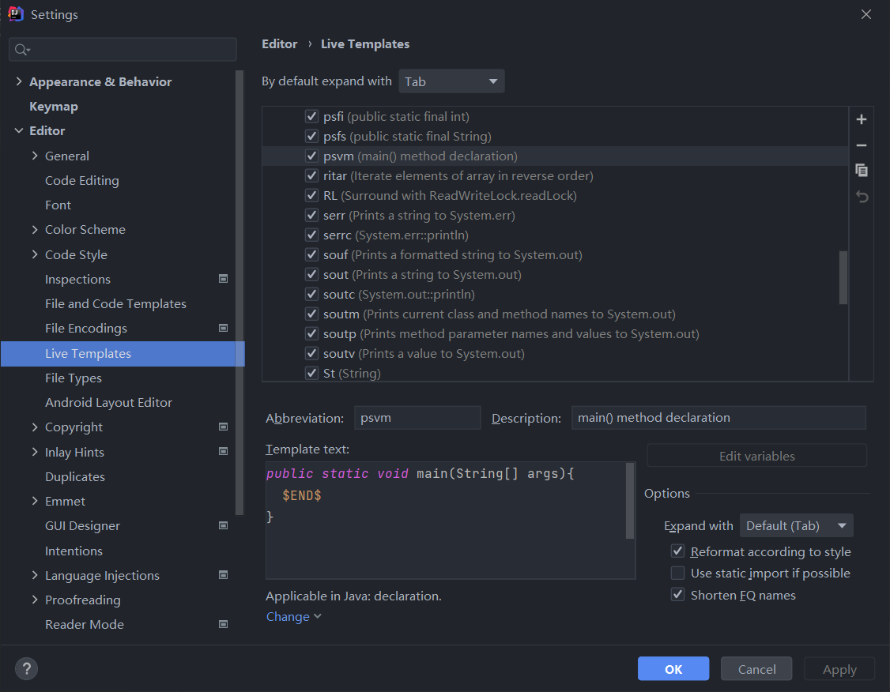
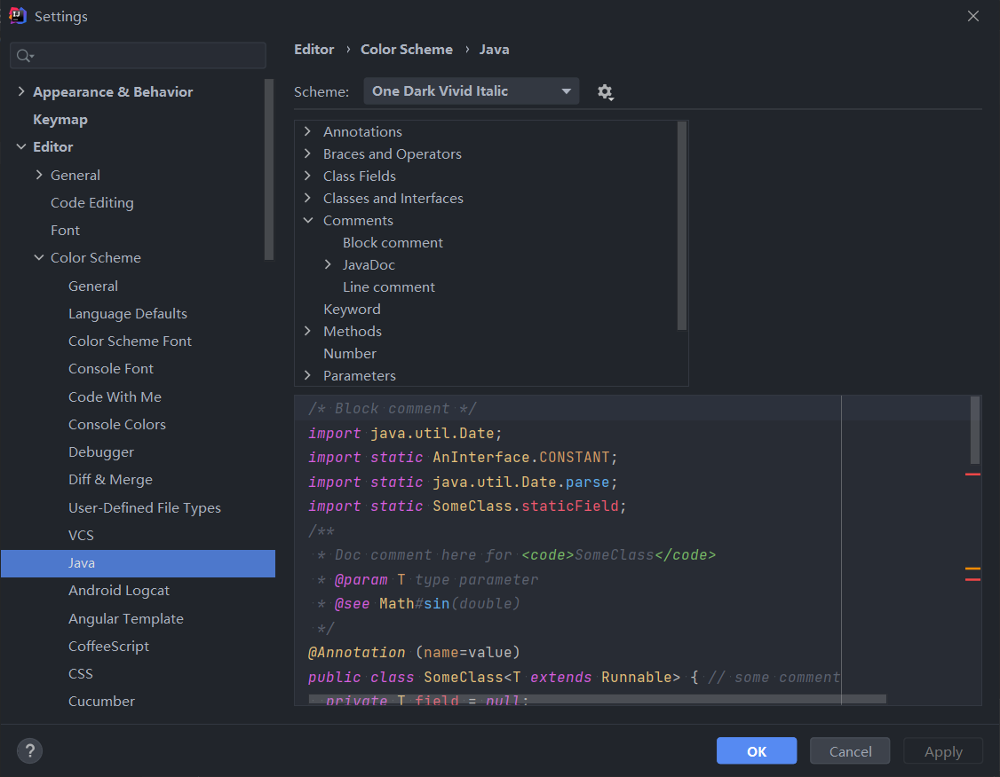

## Templates:

​	Unlike Eclipse, IDEA use *tab* rather than *enter* to build the templates. To set a custom setting, go *File-->Setting-->Editor-->Code Style-->Live Templates*

​	

## Comments:

Go *File-->Setting-->Editor-->Color Scheme-->Java* to set custom change 

There're 3 different types of Comments namely:

- Line Comments: 
  - Hot Key: ctrl+/
- Block Comments
  - Hot Key: ctrl+shift+/
- JavaDoc