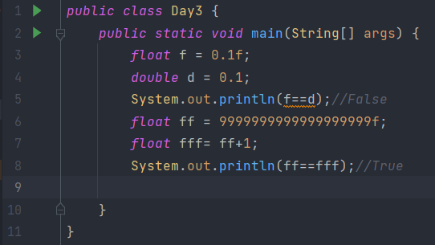

## Identifier:

A Java identifier is a name given to a package, class, interface, method, or variable:

- Case sensitive: Identifier *Hypersus* is different to *hypersus*
- Begin with: Either a letter(A--Z, a--z) or underscore(_) or dollar sign($) BUT NOT a number(0--9)
- Legal letters: English letter(A--Z, a--z), underscore(_), dollar sign($) or **Chinese , Japanese, or anything from the Unicode character set**

## Data Types:

Primitive Type:

| Data Type | Size    | Description                                                  |
| --------- | ------- | ------------------------------------------------------------ |
| byte      | 1 byte  | Stores whole numbers from -128 to 127                        |
| short     | 2 bytes | Stores whole numbers from -32,768 to 32,767                  |
| int       | 4 bytes | Stores whole numbers from -2,147,483,648 to 2,147,483,647    |
| long      | 8 bytes | Stores whole numbers from -9,223,372,036,854,775,808 to 9,223,372,036,854,775,807 |
| float     | 4 bytes | Stores fractional numbers. Sufficient for storing 6 to 7 decimal digits |
| double    | 8 bytes | Stores fractional numbers. Sufficient for storing 15 decimal digits |
| boolean   | 1 bit   | Stores true or false values                                  |
| char      | 2 bytes | Stores a single character/letter or ASCII values             |

NOTE: String is not Primitive Type

## Number Systems:

- Binary number system(marked as *0b* such *0b10* represents 2 in decimal number system)
- Octal number system(marked as *0* such *010* represents 8 in decimal number system)
- Decimal number system
- Hexadecimal number system(marked as *0x* such *0x10* represents 16 in decimal number system)

## Floating-point number:

​	float and double

​	Tips: AVOID using floating-point number to compare which is greater(Use BigDecimal instead)

## Type Conversion:

​	Use (int) to convert a *char* type to *int* according to Unicode chart

- Converting from lower type to higher type, the conversion is done automatically
  - byte-->short-->char--->int->long-->float-->double
- Converting from higher type to lower type, the conversion should be done manually using cast operator () 
  - double-->float-->long-->int-->char-->short-->byte

## Different  Types of Variable:

- Class variable
- Instance variable