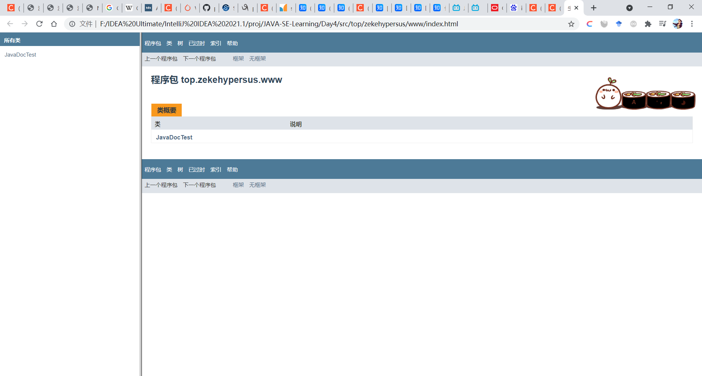

## Operators:

### Increment(++)/Decrement(++) Operator:

- *b=++a* means do *a=a+1* first and then do *b=a*(Same to --)
- *b=a++* means do *b=a* first and then do *a=a+1*(Same to --)

### Pow Operation:

- In Java there is no operator for pow operation like python, instead we use *Class Math* to do these complicated math operation


## JavaDoc:

​	Use */**+enter* to build javadoc comments in java

```java
package top.zekehypersus.www;

public class JavaDocTest {
    /**
     *
     * @param args
     */
    public static void main(String[] args) {

    }

    /**
     *
     * @param tst
     * @return
     */
    private static int myTemplates(int tst){
        int a=1;
        return a;
    }

}
```

Open the package  top.zekehypersus.www in terminal and type 

```java
javadoc -encoding UTF-8 -charset UTF-8 JavaDocTest.java
```

To build the javadoc page as follows;



