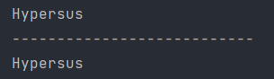

## Normal method

```java
public class Person {
    private String name;
    int age;
    String motto;
    char word;
    
	public String getName() {
        return name;
    }

    public void setName(String name) {
        this.name = name;
    }
}
```

Person in a superclass

```java
public class Student extends Person{
    public void test(){
        System.out.println(this.getName());
        System.out.println("---------------------------");
        System.out.println(super.getName());
    }
}
```

Student is a subclass

```java
public class Test {
    public static void main(String[] args) {
        /**
         * Test normal methods in inheritance
         */
        Student student = new Student();
        student.setName("Hypersus");
        student.test();
    }
}
```

Output in console:



When the property of subclass is set to a particular value, the same property of superclass is also set to the same

## Constructor in Java

```java
public class Person {
    private String name;
    //    String name;
    int age;
    String motto;
    char word;
    /*
    Person class no-arg constructor
     */
    public Person(){
        System.out.println("Person no-arg constructor");
    }
    /*
    Person class parameterized constructor
     */
    public Person(String name){
        System.out.println("Person parameterized constructor");
    }
    public String getName() {
        return name;
    }

    public void setName(String name) {
        this.name = name;
    }
}
```

```java
public class Student extends Person{
    /*
    Student class no-arg constructor
     */
    public Student(){
        System.out.println("Student no-arg constructor");
    }
    /*
    Student class parameterized constructor
     */
    public Student(String name){
        System.out.println("Student parameterized constructor");
    }
}
```

```java
public class Test {
    public static void main(String[] args) {
        Student student = new Student();//no-arg parameters
        System.out.println("---------------------------------");
        Student student1 = new Student("Zeke");//parameterized constructor
    }
}
```

Output in console:


From which we can see:

Every time a subclass is constructed(Whether through no-arg constructor or parameterized constructor), a superclass would be constructed using no-arg constructor(An emitted code *super()* is called) 

